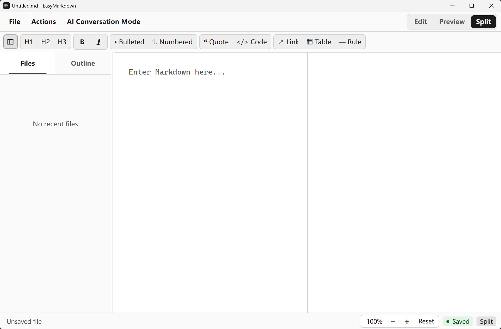

# EasyMarkdown

<p align="center">
  <a href="README.md">中文</a> ·
  <strong>English</strong> ·
  <a href="README.fr.md">Français</a>
</p>



## Overview

EasyMarkdown is a lightweight local Markdown desktop editor with editing, live preview, local file saving, and PDF export.

## Main Features

- Create, open, save, and save Markdown or text files as new files
- Edit, preview, and split views
- Markdown formatting toolbar and common keyboard shortcuts
- Recent files list
- Lightweight MDX rendering
- PDF export
- Chinese, English, and French interfaces
- Open preview links in the default system browser

Lightweight MDX supports the built-in `Icon`, `CardGroup` / `Card`, expanded
`Tabs` / `Tab`, and a limited set of safe HTML. It is not a full MDX runtime
and does not execute component imports, arbitrary JSX, or JavaScript expressions.

## Technology

Tauri 2, Rust, TypeScript, Vite, and Markdown-it.

## Local Development

```powershell
npm install
npm run dev
npm run tauri dev
```

Frontend build:

```powershell
npm run build
```

## Windows Packaging

```powershell
npm run tauri build
```

The Windows build produces an NSIS `.exe` installer with Simplified Chinese, French, and English installer languages.

## License

MIT
