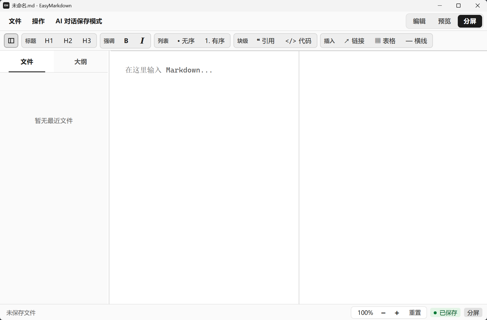

# EasyMarkdown 0.1.1



## 中文

### 项目简介

EasyMarkdown 是一个轻量的本地 Markdown 桌面编辑器，支持编辑、实时预览、保存本地文件和导出 PDF。

### 主要功能

- 新建、打开、保存和另存 Markdown 或文本文件
- 编辑、预览和分屏视图
- Markdown 格式工具栏与常用快捷键
- 最近文件列表
- 系统打印与 PDF 导出
- 中文、英语和法语界面
- 在系统默认浏览器中打开预览链接

### 技术栈

Tauri 2、Rust、TypeScript、Vite、Markdown-it。

### 本地开发

```powershell
npm install
npm run dev
npm run tauri dev
```

前端构建：

```powershell
npm run build
```

### Windows 打包

```powershell
npm run tauri build
```

Windows 构建仅生成 NSIS `.exe` 安装包，支持简体中文、法语和英语安装界面。

## English

### Overview

EasyMarkdown is a lightweight local Markdown desktop editor with editing, live preview, local file saving, and PDF export.

### Main Features

- Create, open, save, and save Markdown or text files as new files
- Edit, preview, and split views
- Markdown formatting toolbar and common keyboard shortcuts
- Recent files list
- System printing and PDF export
- Chinese, English, and French interfaces
- Preview links open in the default system browser

### Technology

Tauri 2, Rust, TypeScript, Vite, and Markdown-it.

### Local Development

```powershell
npm install
npm run dev
npm run tauri dev
```

Frontend build:

```powershell
npm run build
```

### Windows Packaging

```powershell
npm run tauri build
```

The Windows build produces an NSIS `.exe` installer with Simplified Chinese, French, and English installer languages.

## Français

### Présentation

EasyMarkdown est un éditeur Markdown local et léger pour ordinateur, avec édition, aperçu en direct, enregistrement de fichiers locaux et export PDF.

### Fonctions principales

- Créer, ouvrir, enregistrer et enregistrer sous des fichiers Markdown ou texte
- Modes édition, aperçu et écran partagé
- Barre de mise en forme Markdown et raccourcis clavier courants
- Liste des fichiers récents
- Impression système et export PDF
- Interfaces en chinois, anglais et français
- Ouverture des liens de l'aperçu dans le navigateur système par défaut

### Technologies

Tauri 2, Rust, TypeScript, Vite et Markdown-it.

### Développement local

```powershell
npm install
npm run dev
npm run tauri dev
```

Compilation du frontend :

```powershell
npm run build
```

### Création du paquet Windows

```powershell
npm run tauri build
```

La compilation Windows produit uniquement un installateur NSIS `.exe`, disponible en chinois simplifié, français et anglais.

## License

MIT
